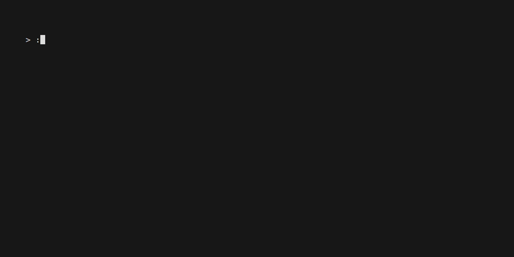
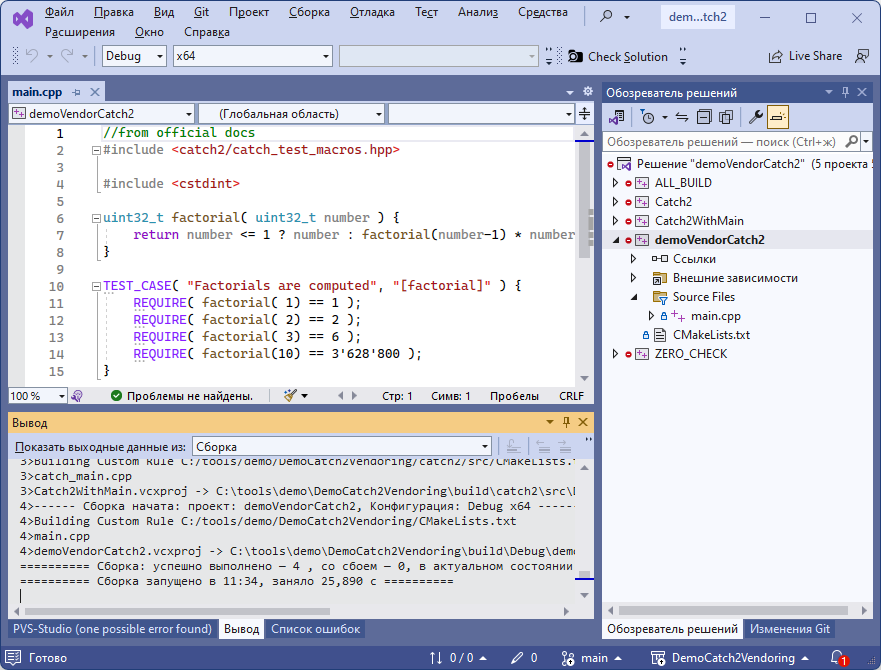
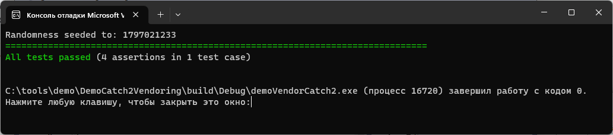

# DemoCatch2Vendoring

Демонстрация catch2 в режиме вендоринга (полной рабочей копии). Этот способ не является рекомендованным, он помогает, если "ну уж совсем никак не собирается". Советую попробовать решение из самого нижнего пункта.

### Сборка и проверка под Windows

Открываем консоль windows, переходим на путь, например `C:\projects`. 

<details>
<summary>Как открыть консоль, если есть проблемы</summary>
  
   * Запуск через меню Пуск:
     * Нажмите кнопку Пуск, которая находится в левом нижнем углу экрана
     * Найдите пункт «Командная строка» или «cmd» в списке программ
     * Нажмите на пункт «Командная строка» или «cmd» для запуска.
   * Запуск через диспетчер задач:
     * Нажмите `Ctrl + Shift + Esc`, чтобы открыть диспетчер задач
     * Нажмите на кнопку «Файл» в верхнем левом углу и выберите «Новый задачи»
     * В поле «Открыть» наберите «cmd» и нажмите Enter.
   * Запуск через Run:
     * Нажмите клавишу `Windows + R`
     * В появившемся окне введите «cmd» и нажмите Enter

   После чего вы должны увидеть примерно следующее окно:
      

</details>

Получаем проект из гита, создаём директорию сборки и конфигурируем для cmake+visual studio:

```
git clone https://github.com/antlas1/DemoCatch2Vendoring.git
cd DemoCatch2Vendoring
mkdir build
cd build
call "C:\Program Files\Microsoft Visual Studio\2022\Community\VC\Auxiliary\Build\vcvars64.bat"
cmake -G "Visual Studio 17 2022" -A "x64" ..
pause
```

Успешные шаги выглядят так:



После конфигурации открываем в студии и собираем:



Правой кнокой на проект **demoVendorCatch2**, делаем активным проектом (он выделится жирным), запускаем тесты:



# Справочная информация

### Создание репозитория с catch2

Как всё начиналось. Создал пустой репозиторий. Далее:

```
git clone https://github.com/antlas1/DemoCatch2Vendoring.git
cd DemoCatch2Vendoring
git clone https://github.com/catchorg/Catch2 catch2
```

Плюс, удалил каталог `.git` из catch2. Пример результата:

```
>git clone git@github.com:antlas1/DemoCatch2Vendoring.git
Cloning into 'DemoCatch2Vendoring'...
remote: Enumerating objects: 4, done.
remote: Counting objects: 100% (4/4), done.
remote: Compressing objects: 100% (4/4), done.
remote: Total 4 (delta 0), reused 0 (delta 0), pack-reused 0
Receiving objects: 100% (4/4), done.

>cd DemoCatch2Vendoring

>git clone https://github.com/catchorg/Catch2 catch2
Cloning into 'catch2'...
remote: Enumerating objects: 37918, done.
remote: Counting objects: 100% (736/736), done.
remote: Compressing objects: 100% (338/338), done.
remote: Total 37918 (delta 457), reused 651 (delta 398), pack-reused 37182
Receiving objects: 100% (37918/37918), 28.29 MiB | 9.87 MiB/s, done.

Resolving deltas: 100% (26813/26813), done.

>git status
On branch main
Your branch is up to date with 'origin/main'.

Untracked files:
  (use "git add <file>..." to include in what will be committed)
        catch2/

nothing added to commit but untracked files present (use "git add" to track)
```

Добавил `CMakeLists.txt`, где указал настройки проекта и поддиректорию с catch2.

### Рекомендации по нормальной настройке

Рекомендация - использовать opensource пакетный менеджер vcpkg. 
Потому что он использует только cmake и позволяет просто и быстро подключить новую библиотеку к проекту. 
Этот пакетный менеджер просто скачивает с гитхаба исходники (или другого открытого ресурса), собирает и раскладывает по своим папочкам однообразно, не зависимо от вида библиотеки. В самом catch-2 тоже пишут как установить с помощью vcpkg. Детально повторяю шаги из инструкции Catch2 для установки:

```
git clone https://github.com/Microsoft/vcpkg.git 
cd vcpkg ./bootstrap-vcpkg.bat 
./vcpkg install catch2:x86-windows
./vcpkg install catch2:x64-windows
```

Проект для юнит-тестирования состоит из main.cpp и CMakeLists.txt. CMakeLists.txt с комментариями:

```
#минимальная версия cmake на котором будет работать 
cmake_minimum_required(VERSION 3.11) 
#название проекта и как следствие солюшена в студии 
project(test_catch2sql) 
#ищем библиотеку для подключения Catch2 из vcpkg: 
find_package(Catch2 CONFIG REQUIRED) 
#добавляем запускаемый файл с именем проекта 
test_catch2sql add_executable(${PROJECT_NAME} main.cpp) 
#линкуем библиотеки Catch2 
target_link_libraries(${PROJECT_NAME} PRIVATE Catch2::Catch2 Catch2::Catch2WithMain)
```

Содержимое main.cpp из репозитория github.com…rg/Catch2:

```cpp
#include <catch2/catch_test_macros.hpp> 
#include <cstdint>  

uint32_t factorial( uint32_t number ) 
{     
    return number <= 1 ? number : factorial(number-1) * number; 
}  

TEST_CASE( "Factorials are computed", "[factorial]" ) {     
    REQUIRE( factorial( 1) == 1 );     
    REQUIRE( factorial( 2) == 2 );     
    REQUIRE( factorial( 3) == 6 );     
    REQUIRE( factorial(10) == 3'628'800 ); 
}
```

При сборке надо только указать путь к тулчайну, где вы только что установили catch, предположим, в C:\vcpkg:

```
cmake -DCMAKE_TOOLCHAIN_FILE=C:\vcpkg\scripts\buildsystems\vcpkg.cmake ../src
```

Собираем и запускаем:

```
>test_catch2.exe 
Randomness seeded to: 2735848181
=============================================================================== 
All tests passed (4 assertions in 1 test case)
```